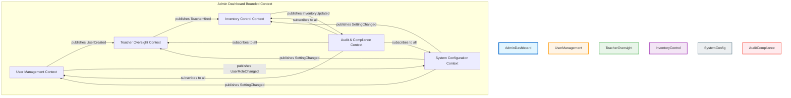
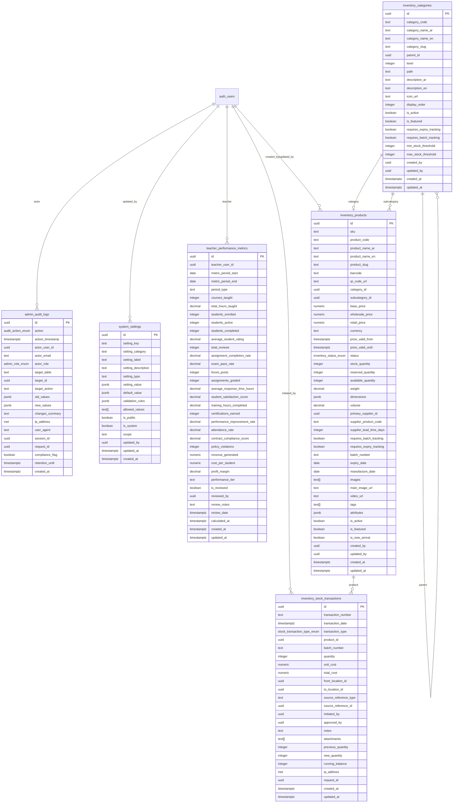

# Admin Dashboard Architecture Design

**Version:** 1.0.0  
**Date:** April 16, 2026  
**Author:** Database Architect & DDD Strategic Designer  
**Status:** Design Specification (No Implementation)

---

## Executive Summary

This document provides a complete architectural design for the Admin Dashboard reconstruction, covering:

1. **Database Schema Design** - 6 new tables with UUID consistency
2. **DDD Bounded Contexts** - Subdomain decomposition and ubiquitous language
3. **FSD Folder Structure** - Feature-Sliced Design organization
4. **Data Integrity Rules** - UUID patterns, FK relationships, audit requirements
5. **RLS Policy Matrix** - Row-level security recommendations

**Key Design Principles:**
- ✅ UUID primary keys for all tables (no auto-increment IDs)
- ✅ "Infinity" stock status for perpetual inventory items
- ✅ Feature-Sliced Design (FSD) for frontend architecture
- ✅ DDD bounded contexts for clear domain boundaries
- ✅ Comprehensive audit trails for compliance
- ✅ Row-level security (RLS) for data protection

---

## 1. Database Schema Design

### 1.1 Enumerations

```sql
-- Inventory status enumeration
CREATE TYPE inventory_status_enum AS ENUM (
    'in_stock',           -- Normal stock available
    'low_stock',          -- Below threshold
    'out_of_stock',       -- Currently unavailable
    'infinity',           -- Perpetual stock (never depletes)
    'discontinued',       -- No longer stocked
    'reserved'            -- Reserved for pending orders
);

-- User role enumeration (extended from existing)
CREATE TYPE admin_role_enum AS ENUM (
    'super_admin',        -- Full system access
    'inventory_manager',  -- Inventory control only
    'teacher_oversight',  -- Teacher management only
    'user_manager',       -- User management only
    'auditor'             -- Read-only audit access
);

-- Audit action enumeration
CREATE TYPE audit_action_enum AS ENUM (
    'user_created',
    'user_updated',
    'user_deleted',
    'user_role_changed',
    'teacher_hired',
    'teacher_fired',
    'teacher_performance_updated',
    'inventory_created',
    'inventory_updated',
    'inventory_deleted',
    'stock_transaction',
    'category_created',
    'category_updated',
    'category_deleted',
    'system_setting_changed',
    'rls_policy_modified',
    'bulk_operation'
);

-- Stock transaction type enumeration
CREATE TYPE stock_transaction_type_enum AS ENUM (
    'receipt',            -- Incoming stock
    'shipment',           -- Outgoing stock
    'adjustment',         -- Manual correction
    'return',             -- Customer return
    'damage',             -- Damaged goods
    'expiration',         -- Expired items
    'transfer_in',        -- From another location
    'transfer_out',       -- To another location
    'audit_correction'    -- Audit adjustment
);
```

### 1.2 Table: `admin_audit_logs`

**Purpose:** Comprehensive audit trail for all admin actions

```sql
CREATE TABLE admin_audit_logs (
    -- Primary Key
    id UUID PRIMARY KEY DEFAULT gen_random_uuid(),
    
    -- Audit Metadata
    action audit_action_enum NOT NULL,
    action_timestamp TIMESTAMPTZ NOT NULL DEFAULT NOW(),
    actor_user_id UUID NOT NULL REFERENCES auth.users(id) ON DELETE CASCADE,
    actor_email TEXT NOT NULL,
    actor_role admin_role_enum NOT NULL,
    
    -- Target Resource
    target_table TEXT NOT NULL,
    target_id UUID,
    target_action 'CREATE' | 'UPDATE' | 'DELETE' NOT NULL,
    
    -- Change Details
    old_values JSONB,
    new_values JSONB,
    changes_summary TEXT,
    
    -- Context
    ip_address INET,
    user_agent TEXT,
    session_id UUID,
    request_id UUID,
    
    -- Compliance
    compliance_flag BOOLEAN DEFAULT FALSE,
    retention_until TIMESTAMPTZ,
    
    -- Indexes
    created_at TIMESTAMPTZ NOT NULL DEFAULT NOW()
);

-- Indexes for performance
CREATE INDEX idx_admin_audit_logs_action ON admin_audit_logs(action);
CREATE INDEX idx_admin_audit_logs_actor ON admin_audit_logs(actor_user_id);
CREATE INDEX idx_admin_audit_logs_target ON admin_audit_logs(target_table, target_id);
CREATE INDEX idx_admin_audit_logs_timestamp ON admin_audit_logs(action_timestamp DESC);
CREATE INDEX idx_admin_audit_logs_compliance ON admin_audit_logs(compliance_flag) WHERE compliance_flag = TRUE;

-- Comment
COMMENT ON TABLE admin_audit_logs IS 'Comprehensive audit trail for all admin actions with compliance tracking';
```

### 1.3 Table: `system_settings`

**Purpose:** Global system configuration and preferences

```sql
CREATE TABLE system_settings (
    -- Primary Key
    id UUID PRIMARY KEY DEFAULT gen_random_uuid(),
    
    -- Setting Identification
    setting_key TEXT NOT NULL UNIQUE,
    setting_category TEXT NOT NULL,
    setting_label TEXT NOT NULL,
    setting_description TEXT,
    
    -- Setting Value
    setting_type TEXT NOT NULL CHECK (setting_type IN ('string', 'number', 'boolean', 'json', 'enum')),
    setting_value JSONB NOT NULL,
    default_value JSONB,
    
    -- Validation
    validation_rules JSONB,
    allowed_values TEXT[],
    
    -- Visibility & Scope
    is_public BOOLEAN DEFAULT FALSE,
    is_system BOOLEAN DEFAULT FALSE,
    scope TEXT DEFAULT 'global' CHECK (scope IN ('global', 'tenant', 'role')),
    
    -- Metadata
    updated_by UUID REFERENCES auth.users(id) ON DELETE SET NULL,
    updated_at TIMESTAMPTZ NOT NULL DEFAULT NOW(),
    created_at TIMESTAMPTZ NOT NULL DEFAULT NOW(),
    
    -- Constraints
    CONSTRAINT valid_setting_type CHECK (
        (setting_type = 'string' AND setting_value ? 'value' AND jsonb_typeof(setting_value->'value') = 'string') OR
        (setting_type = 'number' AND setting_value ? 'value' AND jsonb_typeof(setting_value->'value') = 'number') OR
        (setting_type = 'boolean' AND setting_value ? 'value' AND jsonb_typeof(setting_value->'value') = 'boolean') OR
        (setting_type = 'json' AND setting_value ? 'value') OR
        (setting_type = 'enum' AND setting_value ? 'value')
    )
);

-- Indexes
CREATE INDEX idx_system_settings_category ON system_settings(setting_category);
CREATE INDEX idx_system_settings_scope ON system_settings(scope);
CREATE INDEX idx_system_settings_system_flag ON system_settings(is_system) WHERE is_system = TRUE;

-- Comment
COMMENT ON TABLE system_settings IS 'Global system configuration and preferences with validation rules';
```

### 1.4 Table: `inventory_categories`

**Purpose:** Hierarchical product category structure

```sql
CREATE TABLE inventory_categories (
    -- Primary Key
    id UUID PRIMARY KEY DEFAULT gen_random_uuid(),
    
    -- Category Identification
    category_code TEXT NOT NULL UNIQUE,
    category_name_ar TEXT NOT NULL,  -- Arabic name
    category_name_en TEXT NOT NULL,  -- English name
    category_slug TEXT NOT NULL UNIQUE,
    
    -- Hierarchy
    parent_id UUID REFERENCES inventory_categories(id) ON DELETE SET NULL,
    level INTEGER NOT NULL DEFAULT 0 CHECK (level >= 0),
    path TEXT,  -- Materialized path for efficient querying
    
    -- Metadata
    description_ar TEXT,
    description_en TEXT,
    icon_url TEXT,
    display_order INTEGER DEFAULT 0,
    is_active BOOLEAN DEFAULT TRUE,
    is_featured BOOLEAN DEFAULT FALSE,
    
    -- Business Rules
    requires_expiry_tracking BOOLEAN DEFAULT FALSE,
    requires_batch_tracking BOOLEAN DEFAULT FALSE,
    min_stock_threshold INTEGER DEFAULT 10,
    max_stock_threshold INTEGER,
    
    -- Metadata
    created_by UUID REFERENCES auth.users(id) ON DELETE SET NULL,
    updated_by UUID REFERENCES auth.users(id) ON DELETE SET NULL,
    created_at TIMESTAMPTZ NOT NULL DEFAULT NOW(),
    updated_at TIMESTAMPTZ NOT NULL DEFAULT NOW()
);

-- Indexes
CREATE INDEX idx_inventory_categories_parent ON inventory_categories(parent_id);
CREATE INDEX idx_inventory_categories_path ON inventory_categories(path);
CREATE INDEX idx_inventory_categories_active ON inventory_categories(is_active) WHERE is_active = TRUE;
CREATE INDEX idx_inventory_categories_level ON inventory_categories(level);

-- Unique constraint on code and slug
CREATE UNIQUE INDEX idx_inventory_categories_unique_codes ON inventory_categories(category_code, category_slug);

-- Comment
COMMENT ON TABLE inventory_categories IS 'Hierarchical product category structure with Arabic/English support';
```

### 1.5 Table: `inventory_products`

**Purpose:** Core product catalog with UUID consistency

```sql
CREATE TABLE inventory_products (
    -- Primary Key
    id UUID PRIMARY KEY DEFAULT gen_random_uuid(),
    
    -- Product Identification
    sku TEXT NOT NULL UNIQUE,  -- Stock Keeping Unit
    product_code TEXT NOT NULL,
    product_name_ar TEXT NOT NULL,
    product_name_en TEXT NOT NULL,
    product_slug TEXT NOT NULL UNIQUE,
    barcode TEXT,
    qr_code_url TEXT,
    
    -- Category Reference
    category_id UUID NOT NULL REFERENCES inventory_categories(id) ON DELETE RESTRICT,
    subcategory_id UUID REFERENCES inventory_categories(id) ON DELETE SET NULL,
    
    -- Pricing
    base_price NUMERIC(12, 2) NOT NULL CHECK (base_price >= 0),
    wholesale_price NUMERIC(12, 2) CHECK (wholesale_price >= 0),
    retail_price NUMERIC(12, 2) CHECK (retail_price >= 0),
    currency TEXT DEFAULT 'SAR' CHECK (currency IN ('SAR', 'USD', 'EUR')),
    price_valid_from TIMESTAMPTZ,
    price_valid_until TIMESTAMPTZ,
    
    -- Inventory Status
    status inventory_status_enum NOT NULL DEFAULT 'in_stock',
    stock_quantity INTEGER DEFAULT 0 CHECK (stock_quantity >= 0),
    reserved_quantity INTEGER DEFAULT 0 CHECK (reserved_quantity >= 0),
    available_quantity INTEGER GENERATED ALWAYS AS (
        CASE 
            WHEN status = 'infinity' THEN -1  -- -1 indicates infinite
            ELSE stock_quantity - reserved_quantity 
        END
    ) STORED,
    
    -- Measurements
    weight DECIMAL(10, 3),  -- in kg
    dimensions JSONB,  -- {length, width, height} in cm
    volume DECIMAL(10, 3),  -- in liters/ml
    
    -- Supplier Information
    primary_supplier_id UUID,
    supplier_product_code TEXT,
    supplier_lead_time_days INTEGER,
    
    -- Tracking
    requires_batch_tracking BOOLEAN DEFAULT FALSE,
    requires_expiry_tracking BOOLEAN DEFAULT FALSE,
    batch_number TEXT,
    expiry_date DATE,
    manufacture_date DATE,
    
    -- Media
    images TEXT[],  -- Array of image URLs
    main_image_url TEXT,
    video_url TEXT,
    
    -- Metadata
    tags TEXT[],
    attributes JSONB,  -- Flexible product attributes
    is_active BOOLEAN DEFAULT TRUE,
    is_featured BOOLEAN DEFAULT FALSE,
    is_new_arrival BOOLEAN DEFAULT FALSE,
    
    -- Audit
    created_by UUID REFERENCES auth.users(id) ON DELETE SET NULL,
    updated_by UUID REFERENCES auth.users(id) ON DELETE SET NULL,
    created_at TIMESTAMPTZ NOT NULL DEFAULT NOW(),
    updated_at TIMESTAMPTZ NOT NULL DEFAULT NOW()
);

-- Indexes
CREATE INDEX idx_inventory_products_category ON inventory_products(category_id);
CREATE INDEX idx_inventory_products_sku ON inventory_products(sku);
CREATE INDEX idx_inventory_products_status ON inventory_products(status);
CREATE INDEX idx_inventory_products_active ON inventory_products(is_active) WHERE is_active = TRUE;
CREATE INDEX idx_inventory_products_price ON inventory_products(base_price);
CREATE INDEX idx_inventory_products_tags ON inventory_products USING GIN(tags);
CREATE INDEX idx_inventory_products_attributes ON inventory_products USING GIN(attributes);
CREATE INDEX idx_inventory_products_expiry ON inventory_products(expiry_date) WHERE requires_expiry_tracking = TRUE;

-- Constraints
CREATE UNIQUE INDEX idx_inventory_products_unique_codes ON inventory_products(product_code, product_slug);

-- Check constraints for infinity status
CREATE CONSTRAINT TRIGGER validate_infinity_stock
    AFTER INSERT OR UPDATE ON inventory_products
    FOR EACH ROW
    EXECUTE FUNCTION validate_infinity_stock_constraint();  -- Custom function to be created

-- Comment
COMMENT ON TABLE inventory_products IS 'Core product catalog with UUID primary keys and infinity stock support';
```

### 1.6 Table: `inventory_stock_transactions`

**Purpose:** Complete stock movement tracking

```sql
CREATE TABLE inventory_stock_transactions (
    -- Primary Key
    id UUID PRIMARY KEY DEFAULT gen_random_uuid(),
    
    -- Transaction Identification
    transaction_number TEXT NOT NULL UNIQUE,
    transaction_date TIMESTAMPTZ NOT NULL DEFAULT NOW(),
    transaction_type stock_transaction_type_enum NOT NULL,
    
    -- Product Reference
    product_id UUID NOT NULL REFERENCES inventory_products(id) ON DELETE RESTRICT,
    batch_number TEXT,
    
    -- Quantity
    quantity INTEGER NOT NULL CHECK (quantity > 0),
    unit_cost NUMERIC(12, 2),
    total_cost NUMERIC(14, 2),
    
    -- Location
    from_location_id UUID,  -- Reference to warehouse/location table (future)
    to_location_id UUID,    -- Reference to warehouse/location table (future)
    source_reference_type TEXT,  -- 'purchase_order', 'sales_order', 'adjustment', etc.
    source_reference_id UUID,
    
    -- User & Context
    initiated_by UUID NOT NULL REFERENCES auth.users(id) ON DELETE RESTRICT,
    approved_by UUID REFERENCES auth.users(id) ON DELETE SET NULL,
    notes TEXT,
    attachments TEXT[],  -- Array of file URLs
    
    -- Inventory Impact
    previous_quantity INTEGER NOT NULL,
    new_quantity INTEGER NOT NULL,
    running_balance INTEGER NOT NULL,
    
    -- Audit
    ip_address INET,
    request_id UUID,
    created_at TIMESTAMPTZ NOT NULL DEFAULT NOW(),
    updated_at TIMESTAMPTZ NOT NULL DEFAULT NOW()
);

-- Indexes
CREATE INDEX idx_inventory_transactions_product ON inventory_stock_transactions(product_id);
CREATE INDEX idx_inventory_transactions_date ON inventory_stock_transactions(transaction_date DESC);
CREATE INDEX idx_inventory_transactions_type ON inventory_stock_transactions(transaction_type);
CREATE INDEX idx_inventory_transactions_batch ON inventory_stock_transactions(batch_number) WHERE batch_number IS NOT NULL;
CREATE INDEX idx_inventory_transactions_initiated_by ON inventory_stock_transactions(initiated_by);
CREATE INDEX idx_inventory_transactions_running_balance ON inventory_stock_transactions(product_id, transaction_date);

-- Unique constraint
CREATE UNIQUE INDEX idx_inventory_transactions_number ON inventory_stock_transactions(transaction_number);

-- Comment
COMMENT ON TABLE inventory_stock_transactions IS 'Complete stock movement tracking with batch and location support';
```

### 1.7 Table: `teacher_performance_metrics`

**Purpose:** Teacher performance tracking and oversight

```sql
CREATE TABLE teacher_performance_metrics (
    -- Primary Key
    id UUID PRIMARY KEY DEFAULT gen_random_uuid(),
    
    -- Teacher Reference
    teacher_user_id UUID NOT NULL REFERENCES auth.users(id) ON DELETE CASCADE,
    
    -- Time Period
    metric_period_start DATE NOT NULL,
    metric_period_end DATE NOT NULL,
    period_type TEXT NOT NULL CHECK (period_type IN ('daily', 'weekly', 'monthly', 'quarterly', 'yearly')),
    
    -- Teaching Metrics
    courses_taught INTEGER DEFAULT 0,
    total_hours_taught DECIMAL(8, 2) DEFAULT 0,
    students_enrolled INTEGER DEFAULT 0,
    students_active INTEGER DEFAULT 0,
    students_completed INTEGER DEFAULT 0,
    
    -- Quality Metrics
    average_student_rating DECIMAL(3, 2) CHECK (average_student_rating BETWEEN 1 AND 5),
    total_reviews INTEGER DEFAULT 0,
    assignment_completion_rate DECIMAL(5, 2) CHECK (assignment_completion_rate >= 0 AND assignment_completion_rate <= 100),
    exam_pass_rate DECIMAL(5, 2) CHECK (exam_pass_rate >= 0 AND exam_pass_rate <= 100),
    
    -- Engagement Metrics
    forum_posts INTEGER DEFAULT 0,
    assignments_graded INTEGER DEFAULT 0,
    average_response_time_hours DECIMAL(8, 2),
    student_satisfaction_score DECIMAL(3, 2) CHECK (student_satisfaction_score >= 0 AND student_satisfaction_score <= 100),
    
    -- Professional Development
    training_hours_completed DECIMAL(6, 2) DEFAULT 0,
    certifications_earned INTEGER DEFAULT 0,
    performance_improvement_rate DECIMAL(5, 2) CHECK (performance_improvement_rate >= -100 AND performance_improvement_rate <= 100),
    
    -- Compliance
    attendance_rate DECIMAL(5, 2) CHECK (attendance_rate >= 0 AND attendance_rate <= 100),
    contract_compliance_score DECIMAL(3, 2) CHECK (contract_compliance_score >= 0 AND contract_compliance_score <= 100),
    policy_violations INTEGER DEFAULT 0,
    
    -- Financial
    revenue_generated NUMERIC(14, 2) DEFAULT 0,
    cost_per_student NUMERIC(10, 2),
    profit_margin DECIMAL(5, 2) CHECK (profit_margin >= -100 AND profit_margin <= 100),
    
    -- Status
    performance_tier TEXT CHECK (performance_tier IN ('exceptional', 'exceeds_expectations', 'meets_expectations', 'below_expectations', 'unsatisfactory')),
    is_reviewed BOOLEAN DEFAULT FALSE,
    reviewed_by UUID REFERENCES auth.users(id) ON DELETE SET NULL,
    review_notes TEXT,
    review_date TIMESTAMPTZ,
    
    -- Metadata
    calculated_at TIMESTAMPTZ NOT NULL DEFAULT NOW(),
    created_at TIMESTAMPTZ NOT NULL DEFAULT NOW(),
    updated_at TIMESTAMPTZ NOT NULL DEFAULT NOW(),
    
    -- Constraints
    CONSTRAINT unique_teacher_period UNIQUE (teacher_user_id, metric_period_start, metric_period_end)
);

-- Indexes
CREATE INDEX idx_teacher_metrics_teacher ON teacher_performance_metrics(teacher_user_id);
CREATE INDEX idx_teacher_metrics_period ON teacher_performance_metrics(metric_period_start, metric_period_end);
CREATE INDEX idx_teacher_metrics_tier ON teacher_performance_metrics(performance_tier);
CREATE INDEX idx_teacher_metrics_reviewed ON teacher_performance_metrics(is_reviewed) WHERE is_reviewed = TRUE;
CREATE INDEX idx_teacher_metrics_rating ON teacher_performance_metrics(average_student_rating) WHERE average_student_rating IS NOT NULL;

-- Comment
COMMENT ON TABLE teacher_performance_metrics IS 'Comprehensive teacher performance tracking with quality, engagement, and compliance metrics';
```

### 1.8 Helper Function: Infinity Stock Validation

```sql
-- Custom function to validate infinity stock constraints
CREATE OR REPLACE FUNCTION validate_infinity_stock_constraint()
RETURNS TRIGGER AS $$
BEGIN
    -- If status is 'infinity', stock_quantity must be NULL or negative
    IF NEW.status = 'infinity' THEN
        IF NEW.stock_quantity IS NOT NULL AND NEW.stock_quantity >= 0 THEN
            RAISE EXCEPTION 'Stock quantity cannot be set for infinity status items';
        END IF;
    ELSE
        -- For non-infinity status, stock_quantity must be non-negative
        IF NEW.stock_quantity IS NOT NULL AND NEW.stock_quantity < 0 THEN
            RAISE EXCEPTION 'Stock quantity cannot be negative';
        END IF;
    END IF;
    
    RETURN NEW;
END;
$$ LANGUAGE plpgsql;

-- Trigger
CREATE TRIGGER trigger_validate_infinity_stock
    BEFORE INSERT OR UPDATE ON inventory_products
    FOR EACH ROW
    EXECUTE FUNCTION validate_infinity_stock_constraint();
```

---

## 2. DDD Bounded Contexts

### 2.1 Context Map



### 2.2 Subdomain Classification

| Subdomain | Classification | Priority | Description |
|-----------|---------------|----------|-------------|
| **User Management** | Core | P0 | Central user lifecycle, roles, permissions |
| **Teacher Oversight** | Core | P0 | Teacher performance, hiring, firing, evaluation |
| **Inventory Control** | Supporting | P1 | Product catalog, stock management, categories |
| **System Configuration** | Supporting | P2 | Global settings, preferences, system-wide configurations |
| **Audit & Compliance** | Generic | P1 | Audit trails, compliance tracking, reporting |

### 2.3 Bounded Context Definitions

#### **User Management Context**

**Boundary:** Handles all user-related operations across the system

**Ubiquitous Language:**
- `User` - System actor with authentication credentials
- `Role` - Permission set assigned to users
- `Permission` - Individual access right
- `UserProfile` - Extended user metadata
- `UserLifecycle` - Create, update, deactivate user journey
- `RoleAssignment` - Mapping users to roles
- `AccessControl` - Permission validation

**Core Entities:**
- `User` aggregate root
- `Role` aggregate root
- `Permission` entity
- `UserProfile` value object

**Key Operations:**
- `createUser()` - Register new system user
- `assignRole()` - Grant permissions to user
- `revokeRole()` - Remove permissions from user
- `deactivateUser()` - Soft delete user account
- `updateUserProfile()` - Modify user metadata

**Context Map:**
- **Provides:** UserCreated, UserRoleChanged, UserDeactivated events
- **Consumes:** SystemSettingChanged (for user-related settings)

---

#### **Teacher Oversight Context**

**Boundary:** Manages teacher lifecycle and performance

**Ubiquitous Language:**
- `Teacher` - Certified instructor with teaching credentials
- `HiringProcess` - Teacher recruitment and onboarding
- `PerformanceReview` - Periodic teacher evaluation
- `TeachingAssignment` - Course allocation to teacher
- `PerformanceMetric` - Quantitative teacher KPI
- `ComplianceRecord` - Teacher policy adherence
- `TerminationProcess` - Teacher offboarding

**Core Entities:**
- `Teacher` aggregate root
- `PerformanceReview` aggregate root
- `TeachingAssignment` entity
- `HiringApplication` entity

**Key Operations:**
- `hireTeacher()` - Onboard new teacher
- `evaluateTeacher()` - Conduct performance review
- `assignCourse()` - Allocate course to teacher
- `terminateTeacher()` - Offboard teacher
- `updatePerformanceMetrics()` - Record KPIs

**Context Map:**
- **Provides:** TeacherHired, TeacherFired, PerformanceUpdated events
- **Consumes:** UserCreated (from User Management), InventoryUpdated (for teacher resources)

---

#### **Inventory Control Context**

**Boundary:** Manages product catalog and stock levels

**Ubiquitous Language:**
- `Product` - Sellable item in catalog
- `SKU` - Stock Keeping Unit (unique identifier)
- `Category` - Product classification hierarchy
- `StockLevel` - Current inventory quantity
- `StockTransaction` - Movement record
- `Batch` - Product batch with expiry tracking
- `Supplier` - Product vendor
- `InfinityStock` - Perpetual inventory status
- `RestockThreshold` - Minimum stock level alert

**Core Entities:**
- `Product` aggregate root
- `Category` aggregate root
- `StockTransaction` entity
- `Batch` entity (for tracked items)

**Key Operations:**
- `createProduct()` - Add new product to catalog
- `updateStock()` - Adjust inventory levels
- `recordTransaction()` - Log stock movement
- `categorizeProduct()` - Assign product to category
- `setInfinityStatus()` - Mark product as perpetual stock
- `processRestock()` - Trigger reorder alert

**Context Map:**
- **Provides:** InventoryCreated, InventoryUpdated, StockLow events
- **Consumes:** TeacherHired (for teacher resources), SystemSettingChanged (for pricing rules)

---

#### **System Configuration Context**

**Boundary:** Global system settings and preferences

**Ubiquitous Language:**
- `SystemSetting` - Configurable system parameter
- `SettingCategory` - Logical grouping of settings
- `ValidationRule` - Setting value constraints
- `Scope` - Setting applicability (global/tenant/role)
- `ConfigurationVersion` - Setting change history

**Core Entities:**
- `SystemSetting` aggregate root
- `SettingCategory` entity
- `ConfigurationVersion` entity

**Key Operations:**
- `createSetting()` - Define new system parameter
- `updateSetting()` - Modify setting value
- `validateSetting()` - Check setting against rules
- `setScope()` - Define setting applicability
- `rollbackSetting()` - Revert to previous value

**Context Map:**
- **Provides:** SettingChanged events to all contexts
- **Consumes:** None (top-level context)

---

#### **Audit & Compliance Context**

**Boundary:** Comprehensive audit trail and compliance tracking

**Ubiquitous Language:**
- `AuditLog` - Immutable record of system action
- `ComplianceEvent` - Regulatory requirement trigger
- `RetentionPolicy` - Data retention rules
- `AuditTrail` - Complete action history for entity
- `ComplianceReport` - Regulatory compliance summary

**Core Entities:**
- `AuditLog` aggregate root
- `ComplianceEvent` entity
- `RetentionPolicy` entity

**Key Operations:**
- `recordAudit()` - Log system action
- `generateAuditTrail()` - Retrieve action history
- `applyRetentionPolicy()` - Enforce data retention
- `generateComplianceReport()` - Create compliance summary
- `flagForCompliance()` - Mark audit for review

**Context Map:**
- **Provides:** ComplianceReport, AuditTrail
- **Consumes:** All events from other contexts (UserCreated, TeacherHired, InventoryUpdated, SettingChanged)

---

### 2.4 Ubiquitous Language Glossary

| Term | Definition | Context | Anti-Term |
|------|-----------|---------|-----------|
| **User** | System actor with authentication credentials | User Management | Account (ambiguous) |
| **Teacher** | Certified instructor with teaching credentials | Teacher Oversight | Instructor (too generic) |
| **Product** | Sellable item in inventory catalog | Inventory Control | Item (ambiguous) |
| **SKU** | Unique Stock Keeping Unit identifier | Inventory Control | Code (ambiguous) |
| **Infinity Stock** | Perpetual inventory that never depletes | Inventory Control | Unlimited (incorrect) |
| **Audit Log** | Immutable record of system action | Audit & Compliance | Log (incomplete) |
| **System Setting** | Configurable system parameter | System Configuration | Config (too vague) |
| **Performance Tier** | Teacher performance classification | Teacher Oversight | Rating (incomplete) |
| **Stock Transaction** | Record of inventory movement | Inventory Control | Movement (incomplete) |
| **Compliance Flag** | Audit item requiring review | Audit & Compliance | Flag (ambiguous) |

---

## 3. FSD Folder Structure

### 3.1 Complete Feature-Sliced Design Structure

```
src/features/admin/
├── README.md                          # Feature documentation
├── api/                               # API layer
│   ├── README.md
│   ├── client.ts                      # API client configuration
│   ├── hooks/                         # React Query hooks
│   │   ├── useAdminUsers.ts
│   │   ├── useTeacherMetrics.ts
│   │   ├── useInventoryProducts.ts
│   │   ├── useInventoryCategories.ts
│   │   ├── useStockTransactions.ts
│   │   ├── useSystemSettings.ts
│   │   └── useAdminAuditLogs.ts
│   ├── queries/                       # Query definitions
│   │   ├── userQueries.ts
│   │   ├── teacherQueries.ts
│   │   ├── inventoryQueries.ts
│   │   ├── systemQueries.ts
│   │   └── auditQueries.ts
│   └── mutations/                     # Mutation definitions
│       ├── userMutations.ts
│       ├── teacherMutations.ts
│       ├── inventoryMutations.ts
│       ├── systemMutations.ts
│       └── auditMutations.ts
│
├── components/                        # Feature components
│   ├── README.md
│   ├── ui/                            # UI-only components
│   │   ├── AdminDataTable.tsx
│   │   ├── AdminFilterPanel.tsx
│   │   ├── AdminPagination.tsx
│   │   ├── AdminSearchBar.tsx
│   │   ├── AdminStatusBadge.tsx
│   │   └── AdminActionMenu.tsx
│   ├── users/                         # User Management slice
│   │   ├── UserList.tsx
│   │   ├── UserForm.tsx
│   │   ├── UserRolesModal.tsx
│   │   ├── UserPermissionsPanel.tsx
│   │   └── UserActions.tsx
│   ├── teachers/                      # Teacher Oversight slice
│   │   ├── TeacherList.tsx
│   │   ├── TeacherPerformanceCard.tsx
│   │   ├── TeacherMetricsTable.tsx
│   │   ├── TeacherHiringForm.tsx
│   │   ├── TeacherEvaluationModal.tsx
│   │   └── TeacherStatusBadge.tsx
│   ├── inventory/                     # Inventory Control slice
│   │   ├── ProductList.tsx
│   │   ├── ProductForm.tsx
│   │   ├── CategoryTree.tsx
│   │   ├── StockLevelIndicator.tsx
│   │   ├── StockTransactionForm.tsx
│   │   ├── InfinityStockToggle.tsx
│   │   └── InventoryDashboard.tsx
│   ├── system/                        # System Configuration slice
│   │   ├── SystemSettingsForm.tsx
│   │   ├── SettingCategoryPanel.tsx
│   │   ├── SettingValidator.tsx
│   │   └── ConfigurationHistory.tsx
│   └── audit/                         # Audit & Compliance slice
│       ├── AuditLogTable.tsx
│       ├── AuditFilterPanel.tsx
│       ├── ComplianceReport.tsx
│       └── AuditTrailViewer.tsx
│
├── hooks/                             # Feature-specific hooks
│   ├── README.md
│   ├── useAdminAuthorization.ts       # Admin role checks
│   ├── useAdminFilters.ts             # Filter state management
│   ├── useAdminPagination.ts          # Pagination logic
│   ├── useAdminSearch.ts              # Search functionality
│   ├── useAdminExport.ts              # Data export
│   ├── useAdminNotifications.ts       # Admin alerts
│   └── useAdminAudit.ts               # Audit logging
│
├── logic/                             # Business logic layer
│   ├── README.md
│   ├── users/                         # User Management logic
│   │   ├── userValidation.ts
│   │   ├── roleAssignment.ts
│   │   ├── permissionChecker.ts
│   │   └── userLifecycle.ts
│   ├── teachers/                      # Teacher Oversight logic
│   │   ├── teacherEvaluation.ts
│   │   ├── performanceCalculator.ts
│   │   ├── hiringWorkflow.ts
│   │   └── terminationWorkflow.ts
│   ├── inventory/                     # Inventory Control logic
│   │   ├── productValidation.ts
│   │   ├── stockCalculator.ts
│   │   ├── infinityStockValidator.ts
│   │   ├── transactionValidator.ts
│   │   └── categoryHierarchy.ts
│   ├── system/                        # System Configuration logic
│   │   ├── settingValidator.ts
│   │   ├── settingScopeResolver.ts
│   │   └── configurationHistory.ts
│   └── audit/                         # Audit & Compliance logic
│       ├── auditLogger.ts
│       ├── complianceChecker.ts
│       └── retentionPolicy.ts
│
├── types/                             # TypeScript types
│   ├── README.md
│   ├── api.types.ts                   # API response types
│   ├── forms.types.ts                 # Form types
│   ├── queries.types.ts               # Query parameter types
│   └── index.ts                       # Re-export types
│
├── selectors/                         # State selectors (if using Zustand/Redux)
│   ├── README.md
│   ├── adminUsersSelector.ts
│   ├── teacherMetricsSelector.ts
│   ├── inventorySelector.ts
│   └── systemSettingsSelector.ts
│
├── store/                             # Feature state management
│   ├── README.md
│   ├── adminStore.ts                  # Main admin store
│   └── slices/                        # State slices
│       ├── usersSlice.ts
│       ├── teachersSlice.ts
│       ├── inventorySlice.ts
│       ├── systemSlice.ts
│       └── auditSlice.ts
│
├── constants/                         # Feature constants
│   ├── README.md
│   ├── permissions.ts                 # Admin permissions
│   ├── roles.ts                       # Admin roles
│   ├── inventoryStatus.ts             # Inventory status constants
│   ├── performanceTiers.ts            # Teacher performance tiers
│   └── auditActions.ts                # Audit action types
│
├── services/                          # Business services
│   ├── README.md
│   ├── UserService.ts                 # User management service
│   ├── TeacherService.ts              # Teacher oversight service
│   ├── InventoryService.ts            # Inventory control service
│   ├── SystemService.ts               # System configuration service
│   └── AuditService.ts                # Audit & compliance service
│
├── widgets/                           # Composable widgets
│   ├── README.md
│   ├── UserManagementWidget.tsx       # User management dashboard
│   ├── TeacherOversightWidget.tsx     # Teacher oversight dashboard
│   ├── InventoryControlWidget.tsx     # Inventory control dashboard
│   ├── SystemConfigWidget.tsx         # System configuration dashboard
│   └── AuditComplianceWidget.tsx      # Audit compliance dashboard
│
└── pages/                             # Page-level components
    ├── README.md
    ├── UsersPage.tsx                  # User management page
    ├── TeachersPage.tsx               # Teacher oversight page
    ├── InventoryPage.tsx              # Inventory control page
    ├── SystemSettingsPage.tsx         # System configuration page
    ├── AuditLogsPage.tsx              # Audit logs page
    └── AdminDashboardPage.tsx         # Main admin dashboard
```

### 3.2 FSD Slice Mapping to Subdomains

| FSD Slice | DDD Subdomain | Responsibility |
|-----------|---------------|----------------|
| `features/admin/api/` | All contexts | Data access layer for all bounded contexts |
| `features/admin/components/users/` | User Management | UI components for user operations |
| `features/admin/components/teachers/` | Teacher Oversight | UI components for teacher operations |
| `features/admin/components/inventory/` | Inventory Control | UI components for inventory operations |
| `features/admin/components/system/` | System Configuration | UI components for system settings |
| `features/admin/components/audit/` | Audit & Compliance | UI components for audit operations |
| `features/admin/logic/users/` | User Management | Business logic for user operations |
| `features/admin/logic/teachers/` | Teacher Oversight | Business logic for teacher operations |
| `features/admin/logic/inventory/` | Inventory Control | Business logic for inventory operations |
| `features/admin/logic/system/` | System Configuration | Business logic for system settings |
| `features/admin/logic/audit/` | Audit & Compliance | Business logic for audit operations |
| `features/admin/services/` | All contexts | Service layer coordinating bounded contexts |

---

## 4. Data Integrity Rules

### 4.1 UUID Consistency Patterns

**Pattern 1: Primary Key Standardization**
```sql
-- ALL tables MUST use UUID primary keys
id UUID PRIMARY KEY DEFAULT gen_random_uuid()

-- NEVER use auto-increment integers
-- NEVER use UUIDs as foreign keys without proper indexing
```

**Pattern 2: Foreign Key Constraints**
```sql
-- Use ON DELETE CASCADE for child records
REFERENCES auth.users(id) ON DELETE CASCADE

-- Use ON DELETE RESTRICT for parent records (prevent orphaning)
REFERENCES inventory_categories(id) ON DELETE RESTRICT

-- Use ON DELETE SET NULL for optional relationships
REFERENCES inventory_categories(id) ON DELETE SET NULL
```

**Pattern 3: UUID Indexing**
```sql
-- Always index foreign key columns
CREATE INDEX idx_table_foreign_key ON table(foreign_key_column);

-- Use partial indexes for frequently filtered UUIDs
CREATE INDEX idx_active_products ON inventory_products(id) WHERE is_active = TRUE;
```

### 4.2 Foreign Key Relationship Matrix

| Parent Table | Child Table | Relationship | ON DELETE | ON UPDATE |
|--------------|-------------|--------------|-----------|-----------|
| `auth.users` | `admin_audit_logs` | Actor reference | CASCADE | CASCADE |
| `auth.users` | `system_settings` | Updated by | SET NULL | CASCADE |
| `inventory_categories` | `inventory_categories` | Parent-child | SET NULL | CASCADE |
| `inventory_categories` | `inventory_products` | Category reference | RESTRICT | CASCADE |
| `inventory_products` | `inventory_stock_transactions` | Product reference | RESTRICT | CASCADE |
| `auth.users` | `inventory_stock_transactions` | Initiator reference | RESTRICT | CASCADE |
| `auth.users` | `teacher_performance_metrics` | Teacher reference | CASCADE | CASCADE |
| `inventory_categories` | `inventory_products` | Subcategory reference | SET NULL | CASCADE |

### 4.3 Cascade Delete Rules

**Safe to Cascade:**
- ✅ Audit logs when user is deleted (historical record preserved via email copy)
- ✅ Teacher metrics when teacher user is deleted
- ✅ Child categories when parent category is deleted (SET NULL)
- ✅ Stock transactions when product is deleted (if business allows)

**Prevent Cascade:**
- ❌ Prevent category deletion if products exist (use RESTRICT)
- ❌ Prevent product deletion if stock transactions exist (use RESTRICT)
- ❌ Prevent teacher deletion if performance metrics exist (use CASCADE with archival)

### 4.4 Audit Trail Requirements

**Mandatory Audit Events:**
1. **User Management:**
   - User creation, update, deletion
   - Role assignment/revocation
   - Permission changes

2. **Teacher Oversight:**
   - Teacher hiring/termination
   - Performance metric updates
   - Course assignment changes

3. **Inventory Control:**
   - Product creation/update/deletion
   - Stock level changes
   - Category modifications
   - Stock transactions

4. **System Configuration:**
   - System setting changes
   - Scope modifications
   - Validation rule updates

**Audit Log Structure:**
```typescript
interface AuditLog {
  id: UUID;
  action: AuditAction;
  actor: {
    userId: UUID;
    email: string;
    role: AdminRole;
  };
  target: {
    table: string;
    entityId: UUID;
    actionType: 'CREATE' | 'UPDATE' | 'DELETE';
  };
  changes: {
    oldValue: Record<string, unknown>;
    newValue: Record<string, unknown>;
    summary: string;
  };
  context: {
    ipAddress?: string;
    userAgent?: string;
    sessionId?: UUID;
    requestId?: UUID;
  };
  compliance: {
    isComplianceFlagged: boolean;
    retentionUntil?: Date;
  };
  timestamp: Date;
}
```

### 4.5 Data Validation Rules

**UUID Validation:**
```typescript
// All UUIDs must be valid format
const uuidRegex = /^[0-9a-f]{8}-[0-9a-f]{4}-[1-5][0-9a-f]{3}-[89abAB][0-9a-f]{3}-[0-9a-f]{12}$/i;

function isValidUUID(uuid: string): boolean {
  return uuidRegex.test(uuid);
}
```

**Infinity Stock Validation:**
```typescript
// Infinity status requires special handling
function validateInfinityStock(status: InventoryStatus, stockQuantity: number | null): void {
  if (status === 'infinity') {
    if (stockQuantity !== null && stockQuantity >= 0) {
      throw new Error('Stock quantity cannot be set for infinity status items');
    }
  } else {
    if (stockQuantity !== null && stockQuantity < 0) {
      throw new Error('Stock quantity cannot be negative');
    }
  }
}
```

**Business Rule Validation:**
```typescript
// Stock quantity constraints
function validateStockQuantity(quantity: number, status: InventoryStatus): void {
  if (status === 'infinity') {
    // Infinity status ignores quantity
    return;
  }
  
  if (quantity < 0) {
    throw new Error('Stock quantity cannot be negative');
  }
  
  if (quantity > MAX_STOCK_LIMIT) {
    throw new Error(`Stock quantity exceeds maximum limit of ${MAX_STOCK_LIMIT}`);
  }
}

// Price validation
function validatePrices(prices: {
  base: number;
  wholesale?: number;
  retail?: number;
}): void {
  if (prices.wholesale && prices.wholesale > prices.base) {
    throw new Error('Wholesale price cannot exceed base price');
  }
  
  if (prices.retail && prices.retail < prices.base) {
    throw new Error('Retail price cannot be less than base price');
  }
}
```

---

## 5. RLS Policy Matrix

### 5.1 Policy Overview

| Table | Policy Name | Role | Conditions |
|-------|-------------|------|------------|
| `admin_audit_logs` | `admin_can_view_audit_logs` | `admin_role` | TRUE |
| `admin_audit_logs` | `admin_can_insert_audit_logs` | `admin_role` | TRUE |
| `admin_audit_logs` | `admin_can_update_audit_logs` | `super_admin` | TRUE |
| `system_settings` | `admin_can_view_settings` | `admin_role` | `is_public = TRUE OR scope = 'global'` |
| `system_settings` | `admin_can_modify_settings` | `super_admin` | TRUE |
| `inventory_categories` | `admin_can_view_categories` | `admin_role` | `is_active = TRUE` |
| `inventory_categories` | `admin_can_modify_categories` | `inventory_manager` | TRUE |
| `inventory_products` | `admin_can_view_products` | `admin_role` | `is_active = TRUE` |
| `inventory_products` | `admin_can_modify_products` | `inventory_manager` | TRUE |
| `inventory_stock_transactions` | `admin_can_view_transactions` | `admin_role` | TRUE |
| `inventory_stock_transactions` | `admin_can_insert_transactions` | `inventory_manager` | TRUE |
| `teacher_performance_metrics` | `admin_can_view_metrics` | `teacher_oversight` | TRUE |
| `teacher_performance_metrics` | `admin_can_update_metrics` | `super_admin` | TRUE |

### 5.2 RLS Policy Definitions

```sql
-- Enable RLS on all admin tables
ALTER TABLE admin_audit_logs ENABLE ROW LEVEL SECURITY;
ALTER TABLE system_settings ENABLE ROW LEVEL SECURITY;
ALTER TABLE inventory_categories ENABLE ROW LEVEL SECURITY;
ALTER TABLE inventory_products ENABLE ROW LEVEL SECURITY;
ALTER TABLE inventory_stock_transactions ENABLE ROW LEVEL SECURITY;
ALTER TABLE teacher_performance_metrics ENABLE ROW LEVEL SECURITY;

-- Admin Audit Logs Policies
CREATE POLICY admin_can_view_audit_logs ON admin_audit_logs
    FOR SELECT
    TO authenticated
    USING (
        EXISTS (
            SELECT 1 FROM admin_roles ar
            WHERE ar.user_id = auth.uid()
            AND ar.role IN ('super_admin', 'auditor', 'inventory_manager', 'teacher_oversight', 'user_manager')
        )
    );

CREATE POLICY admin_can_insert_audit_logs ON admin_audit_logs
    FOR INSERT
    TO authenticated
    WITH CHECK (
        EXISTS (
            SELECT 1 FROM admin_roles ar
            WHERE ar.user_id = auth.uid()
            AND ar.role IN ('super_admin', 'auditor', 'inventory_manager', 'teacher_oversight', 'user_manager')
        )
    );

CREATE POLICY admin_can_update_audit_logs ON admin_audit_logs
    FOR UPDATE
    TO authenticated
    USING (
        EXISTS (
            SELECT 1 FROM admin_roles ar
            WHERE ar.user_id = auth.uid()
            AND ar.role = 'super_admin'
        )
    );

-- System Settings Policies
CREATE POLICY admin_can_view_settings ON system_settings
    FOR SELECT
    TO authenticated
    USING (
        (is_public = TRUE OR scope = 'global')
        OR EXISTS (
            SELECT 1 FROM admin_roles ar
            WHERE ar.user_id = auth.uid()
            AND ar.role IN ('super_admin', 'inventory_manager', 'teacher_oversight', 'user_manager')
        )
    );

CREATE POLICY admin_can_modify_settings ON system_settings
    FOR ALL
    TO authenticated
    USING (
        EXISTS (
            SELECT 1 FROM admin_roles ar
            WHERE ar.user_id = auth.uid()
            AND ar.role = 'super_admin'
        )
    );

-- Inventory Categories Policies
CREATE POLICY admin_can_view_categories ON inventory_categories
    FOR SELECT
    TO authenticated
    USING (
        is_active = TRUE
        OR EXISTS (
            SELECT 1 FROM admin_roles ar
            WHERE ar.user_id = auth.uid()
            AND ar.role = 'super_admin'
        )
    );

CREATE POLICY admin_can_modify_categories ON inventory_categories
    FOR ALL
    TO authenticated
    USING (
        EXISTS (
            SELECT 1 FROM admin_roles ar
            WHERE ar.user_id = auth.uid()
            AND ar.role IN ('super_admin', 'inventory_manager')
        )
    );

-- Inventory Products Policies
CREATE POLICY admin_can_view_products ON inventory_products
    FOR SELECT
    TO authenticated
    USING (
        is_active = TRUE
        OR EXISTS (
            SELECT 1 FROM admin_roles ar
            WHERE ar.user_id = auth.uid()
            AND ar.role = 'super_admin'
        )
    );

CREATE POLICY admin_can_modify_products ON inventory_products
    FOR ALL
    TO authenticated
    USING (
        EXISTS (
            SELECT 1 FROM admin_roles ar
            WHERE ar.user_id = auth.uid()
            AND ar.role IN ('super_admin', 'inventory_manager')
        )
    );

-- Stock Transactions Policies
CREATE POLICY admin_can_view_transactions ON inventory_stock_transactions
    FOR SELECT
    TO authenticated
    USING (
        EXISTS (
            SELECT 1 FROM admin_roles ar
            WHERE ar.user_id = auth.uid()
            AND ar.role IN ('super_admin', 'inventory_manager', 'auditor')
        )
    );

CREATE POLICY admin_can_insert_transactions ON inventory_stock_transactions
    FOR INSERT
    TO authenticated
    WITH CHECK (
        EXISTS (
            SELECT 1 FROM admin_roles ar
            WHERE ar.user_id = auth.uid()
            AND ar.role IN ('super_admin', 'inventory_manager')
        )
    );

-- Teacher Performance Metrics Policies
CREATE POLICY admin_can_view_metrics ON teacher_performance_metrics
    FOR SELECT
    TO authenticated
    USING (
        EXISTS (
            SELECT 1 FROM admin_roles ar
            WHERE ar.user_id = auth.uid()
            AND ar.role IN ('super_admin', 'teacher_oversight')
        )
    );

CREATE POLICY admin_can_update_metrics ON teacher_performance_metrics
    FOR ALL
    TO authenticated
    USING (
        EXISTS (
            SELECT 1 FROM admin_roles ar
            WHERE ar.user_id = auth.uid()
            AND ar.role = 'super_admin'
        )
    );
```

---

## 6. ER Diagram



---

## 7. Implementation Roadmap

### Phase 1: Foundation (Week 1-2)
- [ ] Create enumeration types
- [ ] Create `admin_audit_logs` table
- [ ] Create `system_settings` table
- [ ] Implement basic RLS policies

### Phase 2: Inventory Core (Week 3-4)
- [ ] Create `inventory_categories` table
- [ ] Create `inventory_products` table
- [ ] Implement infinity stock validation
- [ ] Create inventory RLS policies

### Phase 3: Stock Tracking (Week 5)
- [ ] Create `inventory_stock_transactions` table
- [ ] Implement stock calculation logic
- [ ] Create transaction RLS policies

### Phase 4: Teacher Oversight (Week 6)
- [ ] Create `teacher_performance_metrics` table
- [ ] Implement performance calculation logic
- [ ] Create teacher metrics RLS policies

### Phase 5: Frontend FSD (Week 7-8)
- [ ] Set up FSD folder structure
- [ ] Implement API layer
- [ ] Build core components
- [ ] Create page-level components

---

## 8. Compliance & Security Considerations

### 8.1 Data Retention
- Audit logs: 7 years for compliance-flagged entries
- Stock transactions: 5 years minimum
- Teacher metrics: 3 years minimum
- System settings: Indefinite (configuration history)

### 8.2 Privacy Requirements
- PII in audit logs must be encrypted at rest
- User emails in audit logs should be hashed for privacy
- IP addresses should be anonymized after 90 days

### 8.3 Access Control
- Super admin: Full access to all tables
- Role-specific admins: Access limited to their domain
- Auditors: Read-only access to audit logs
- All access logged to `admin_audit_logs`

---

## 9. Performance Optimization Recommendations

### 9.1 Indexing Strategy
- UUID primary keys: B-tree (default)
- Foreign keys: B-tree indexes
- JSONB columns: GIN indexes
- Timestamp columns: B-tree descending indexes
- Status/flag columns: Partial indexes

### 9.2 Partitioning Strategy
- `admin_audit_logs`: Partition by month (time-series)
- `inventory_stock_transactions`: Partition by quarter
- `teacher_performance_metrics`: Partition by year

### 9.3 Caching Recommendations
- System settings: Cache in application layer (TTL: 5 minutes)
- Inventory categories: Cache hierarchy (TTL: 15 minutes)
- Teacher metrics: Cache aggregated views (TTL: 1 hour)

---

## 10. Appendix

### A. Migration Script Template
```sql
-- Example migration file: 2026-04-16-create-admin-schema.sql
BEGIN;

-- Create enumerations
CREATE TYPE inventory_status_enum AS ENUM (...);
CREATE TYPE admin_role_enum AS ENUM (...);
CREATE TYPE audit_action_enum AS ENUM (...);
CREATE TYPE stock_transaction_type_enum AS ENUM (...);

-- Create tables
CREATE TABLE admin_audit_logs (...);
CREATE TABLE system_settings (...);
CREATE TABLE inventory_categories (...);
CREATE TABLE inventory_products (...);
CREATE TABLE inventory_stock_transactions (...);
CREATE TABLE teacher_performance_metrics (...);

-- Create indexes
CREATE INDEX ...;

-- Create functions
CREATE FUNCTION validate_infinity_stock_constraint() ...;

-- Create triggers
CREATE TRIGGER trigger_validate_infinity_stock ...;

-- Enable RLS
ALTER TABLE ... ENABLE ROW LEVEL SECURITY;

-- Create policies
CREATE POLICY ...;

COMMIT;
```

### B. Testing Checklist
- [ ] UUID generation verified
- [ ] Infinity stock validation tested
- [ ] RLS policies tested for each role
- [ ] Foreign key constraints tested
- [ ] Cascade delete behavior verified
- [ ] Audit logging verified
- [ ] Performance tested with 1M+ records

### C. Monitoring Metrics
- Audit log growth rate
- Stock transaction volume
- Teacher metric calculation frequency
- RLS policy denial rate
- Query performance on large tables

---

**Document End**

*This design document provides complete specifications for Admin Dashboard reconstruction. Implementation should follow this design exactly to ensure UUID consistency, data integrity, and compliance with DDD and FSD principles.*
